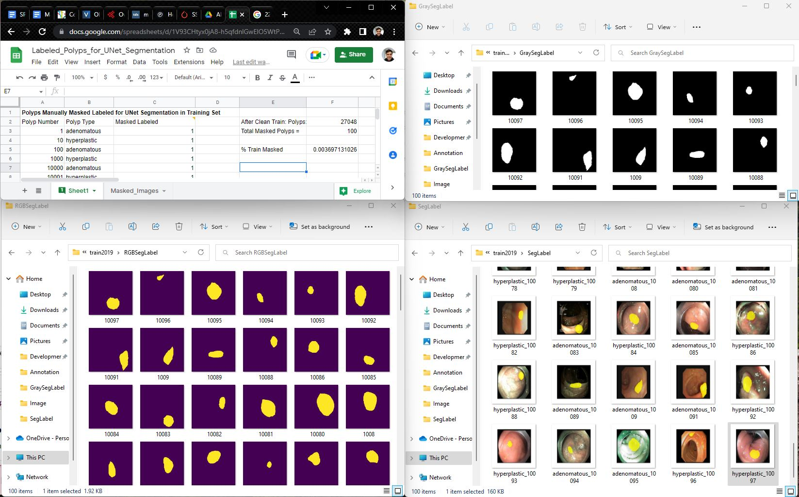
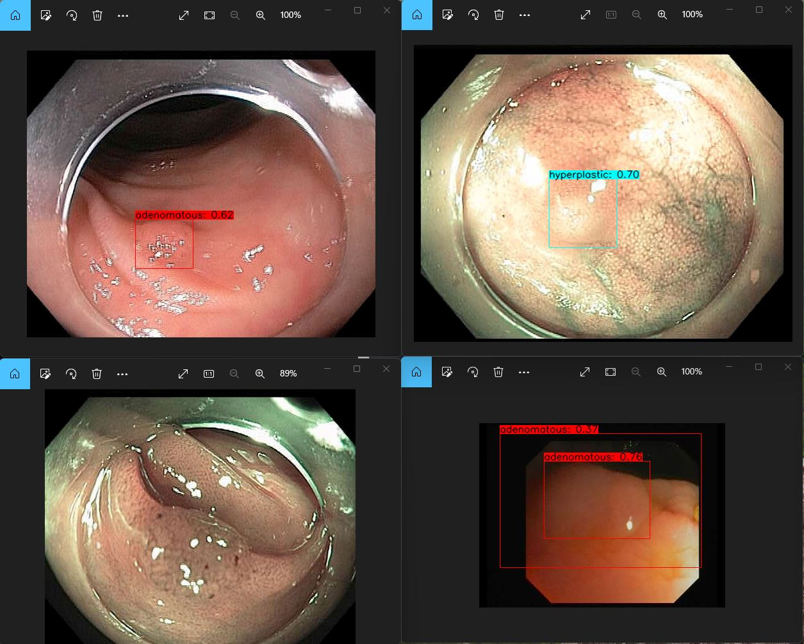

# Lesion-Detection (CMPE257 Spring 2022)

Guide to Deploying Lesion Detection Dev environment in a Docker container:

- [Deploy CMPE257 ML LD Docker Container](./docs/README.md)

Lesion Detection for ESD in colon

Abstract (Purpose of ML App):

A gastroenterologist is a doctor who diagnoses patients for colon cancer, which is one of the most common diagnosed cancers throughout the world. Detecting these lesions in the colon usually requires using an endoscope device with a camera that goes to the patient’s colon area. This lesion detection is also a difficult challenge for specialists, which could result in human error. So AI/ML engineers have stepped in to provide assistance to these specialists to increase the accuracy and the early diagnosis rate for lesion detection. After consulting with some medical tech companies about the data set they would want to use for AI/ML, we have determined we will need to either create a data set from scratch from several YouTube videos where specialists identified lesions in the colon or find a data set that has already been created doing a similar process just mentioned. For creating the data set, we would extract out the frames from these videos, label a sample of the frames with “lesion or not lesion” to do semi-supervised learning. We plan to read multiple publications on the latest Deep Neural Network architectures that are being used to identify lesions in the colon. The goal that some of these companies are aiming to do is perform non-invasive techniques to treat or remove the patients colon cancer usually a procedure known as Endoscopic submucosal dissection (ESD) and lesion detection will help in the process of using automated robotic surgery to cut out the lesion from the patient, ultimately reducing the mortality rate of colorectal cancer.

## CNN Polyp Classification Model Notebook

For more info on our CNN Polyp Classification model, check out our notebook below:

**[CNN_Polyp_Classification](Notebooks/CNN_Polyp_Classification.ipynb)**

## UNet Polyp Segmentation Model Notebook

For more info on our UNet Polyp Segmentation model, check out our notebook below:

  [UNet_Polyp_Segmentation](Notebooks/UNet_Polyp_Segmentation.ipynb)

For this notebook above, we manually created our own segmentation labeled images:

## YOLOv4 Polyp Detection Model Notebook

For more info on our YOLOv4 Polyp Detection model, check out our notebook below:

- [YOLOv4_Polyp_Detection](Notebooks/YOLOv4_Polyp_Detection.ipynb)

At the end of YOLOv4 Polyp Detection notebook, you will know how to train it to be able to detect polyps like the following:

## Integrating Our Models into Rasa AI System

We have made conversational chatbot using Rasa with four different entities interacting with chatbot. The entities were Doctor, Physician, Surgeon and Student. Our goal here with the conversations was to eventually lead to our DL models being deployed in Rasa to classify, detect or segment polyps in images and return those reports to the care providers. The conversation flow between each entity and chatbot is as follows:

1. Doctor:
-> Doctor will ask about symptoms regarding colon cancer.
-> Doctor will ask about types of treatments we can use to cure it?

 
Dataset links
https://enric1994.github.io/synth-colon/
Case 8_Colonoscopy with NBI and ESD for colonic lateral spreading tumors
For example, https://www.youtube.com/watch?v=3_4b086YEdY
Case 14_Colonoscopy with chromoendoscopy and hybrid ESD technique for recurrent colonic adenoma
For example, https://www.youtube.com/watch?v=gdqOigwvUQA
 
Reference links
Artificial Intelligence in Colorectal Cancer Screening, Diagnosis and Treatment. A New Era: https://www.ncbi.nlm.nih.gov/pmc/articles/PMC8161764/

Artificial intelligence in gastrointestinal endoscopy, ScienceDirect: https://www.sciencedirect.com/science/article/pii/S2468448120302721

Deep learning driven colorectal lesion detection in gastrointestinal endoscopic and pathological imaging: https://www.ncbi.nlm.nih.gov/pmc/articles/PMC8610875/

Artificial Intelligence- Assisted Polyp Detection System for Colonoscopy, based on the largest available collection of clinical video data for machine learning: :https://www.giejournal.org/article/S0016-5107(19)31325-2/fulltext#relatedArticles

Deep learning for diagnosis of precancerous lesions in upper gastrointestinal endoscopy: https://www.ncbi.nlm.nih.gov/pmc/articles/PMC8160615/

A novel machine learning-based algorithm to identify and classify lesions and anatomical landmarks in colonoscopy images: https://link.springer.com/article/10.1007/s00464-021-08331-2
https://wd.vghtpe.gov.tw/ecdt/Fpage.action?muid=2388&fid=5621

EARLIER DIAGNOSIS OF CANCER OF THE COLON THROUGH COLONIC ENDOSCOPY (COLONOSCOPY):
https://acsjournals.onlinelibrary.wiley.com/doi/epdf/10.1002/1097-0142%28197409%2934%3A3%2B%3C912%3A%3AAID-CNCR2820340720%3E3.0.CO%3B2-P

Artificial Intelligence-Assisted Polyp Detection for Colonoscopy: https://www.sciencedirect.com/science/article/pii/S0016508518304153?via%3Dihub

Artificial Intelligence-Based Classification of Multiple Gastrointestinal Diseases Using Endoscopy Videos for Clinical Diagnosis:
https://www.mdpi.com/2077-0383/8/7/986/htm

Colonoscopy polyp detection and classification: Dataset creation and comparative evaluations:
https://journals.plos.org/plosone/article?id=10.1371/journal.pone.0255809
Development and Validation of a Deep Neural Network for Accurate Evaluation of Endoscopic Images From Patients With Ulcerative Colitis

https://www.sciencedirect.com/science/article/abs/pii/S0016508520302122?via%3Dihub
